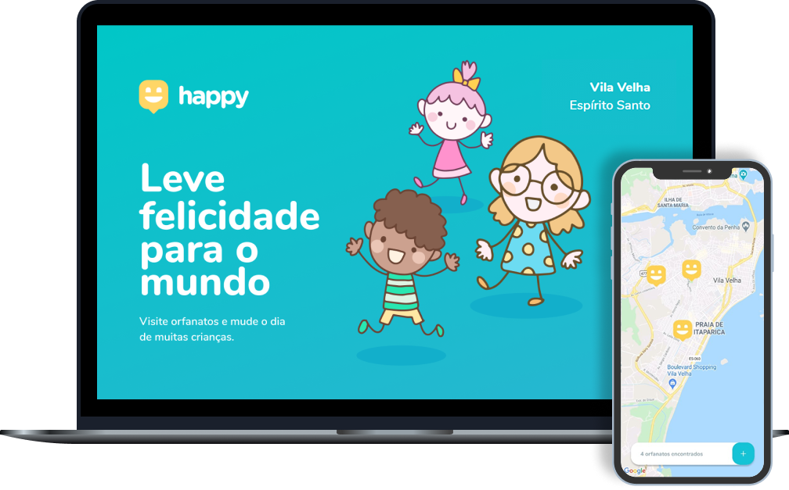

<p align="center">
  
</p>


<h3 align="center"> Next Level Week #03 

 [API](##-API-(Back-end)) | [WEB](##-WEB-(Front-end)) | [MOBILE](##-MOBILE-(App))
 
</h3>

<h1 align="center">
    
</h1>

## 📚 Sobre 

O projeto **happy** foi desenvolvido com o objetivo de conectar pessoas às crianças em orfanatos, para que possam contribuir e trazer alegria para os pequeninos.

Essa aplicação foi realizada durante a Next Level Week #3, projeto da Rocketseat, com tutoria de Diego Fernandes.

---


## 🚀 Tecnologias Utilizadas

- Typescript
- ReactJs
- React Native
- Expo
- Node
- Yup
- Typeorm
- leaflet react (Mapa)

---

## ⏱ Iniciar projeto 

### API (Back-end)


```bash
# Clonar o repositório
$ git clone https://github.com/polyanetuag/happy.git 

# Entrar na pasta server 
$ cd happy/server

# Instalar as dependências
$ yarn install

# Iniciar o servidor
$ yarn start

```

### Web (Front-end)

```bash

# Entrar na pasta web 
$ cd happy/web

# Instalar as dependências
$ yarn install

# Iniciar a aplicação
$ yarn start

```

### Mobile (App)

```bash
# Entrar na pasta mobile
$ cd happy/mobile

# Instalar as dependências
$ yarn install

# Iniciar o app
$ yarn start

# Obs: Escaneie o QR Code exibido na janela do navegador.
```

---

### 📋 Licença

Esse projeto está sob a licença MIT. Veja o arquivo LICENSE para mais detalhes.


---
Desenvolvido com 💜 por Polyane Tuag
