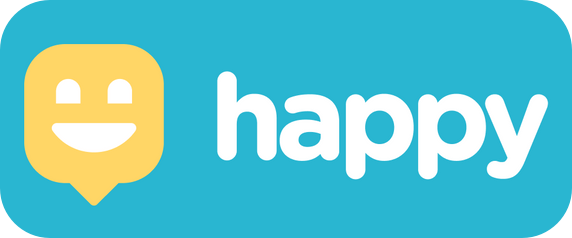
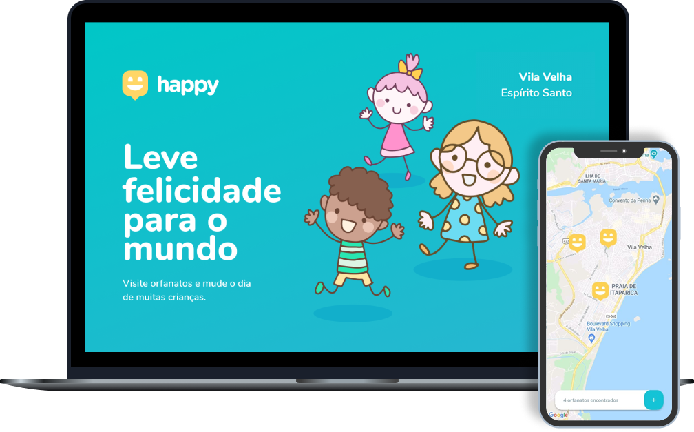

<p align="center">
  
</p>


<h3 align="center"> Next Level Week #03 

 [API](##-API-(Back-end)) | [WEB](##-WEB-(Front-end)) | [MOBILE](##-MOBILE-(App))
 
</h3>

<h1 align="center">
    
</h1>

## 📚 Sobre 

O projeto ***happy*** foi desenvolvido com o objetivo de conectar pessoas às crianças que vivem em orfanatos, para que possam contribuir e trazer alegria para os pequeninos. 

Na aplicação, você pode consultar os orfanatos em cada estado/cidade e fazer a sua doação.

Ese aplicativo foi feito durante a semana *Next Level Week #3* da Rocketseat, com tutoria de Diego Fernandes.

## 🚀 Tecnologias Utilizadas

- [Typescript](https://www.typescriptlang.org/)
- [ReactJs](https://react.dev/)
- [React Native](https://reactnative.dev/)
- [Expo](https://expo.dev/)
- [Node](https://nodejs.org/pt)
- [Yup](https://www.npmjs.com/package/yup/v/1.0.0-alpha.3)
- [Typeorm](https://typeorm.io/)
- [Leaflet react](https://leafletjs.com/) (Biblioteca para o Mapa)

## ⏱ Iniciar projeto 

### API (Back-end)
```bash
# Clonar o repositório
$ git clone https://github.com/polyanetuag/happy.git 

# Entrar na pasta server 
$ cd happy/server

# Instalar as dependências
$ yarn install

# Iniciar o servidor
$ yarn start

```

### Web (Front-end)

```bash

# Entrar na pasta web 
$ cd happy/web

# Instalar as dependências
$ yarn install

# Iniciar a aplicação
$ yarn start

```

### Mobile (App)

```bash
# Entrar na pasta mobile
$ cd happy/mobile

# Instalar as dependências
$ yarn install

# Iniciar o app
$ yarn start

# Obs: Escaneie o QR Code exibido na janela do navegador.
```

### 📋 Licença

Esse projeto está sob a licença [MIT](https://opensource.org/license/mit). 


---
Desenvolvido com 💜 por Polyane Tuag
